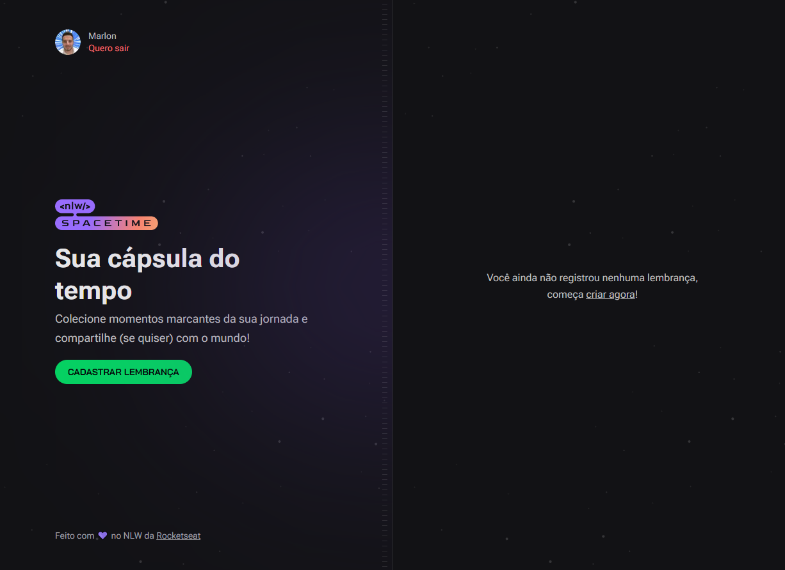
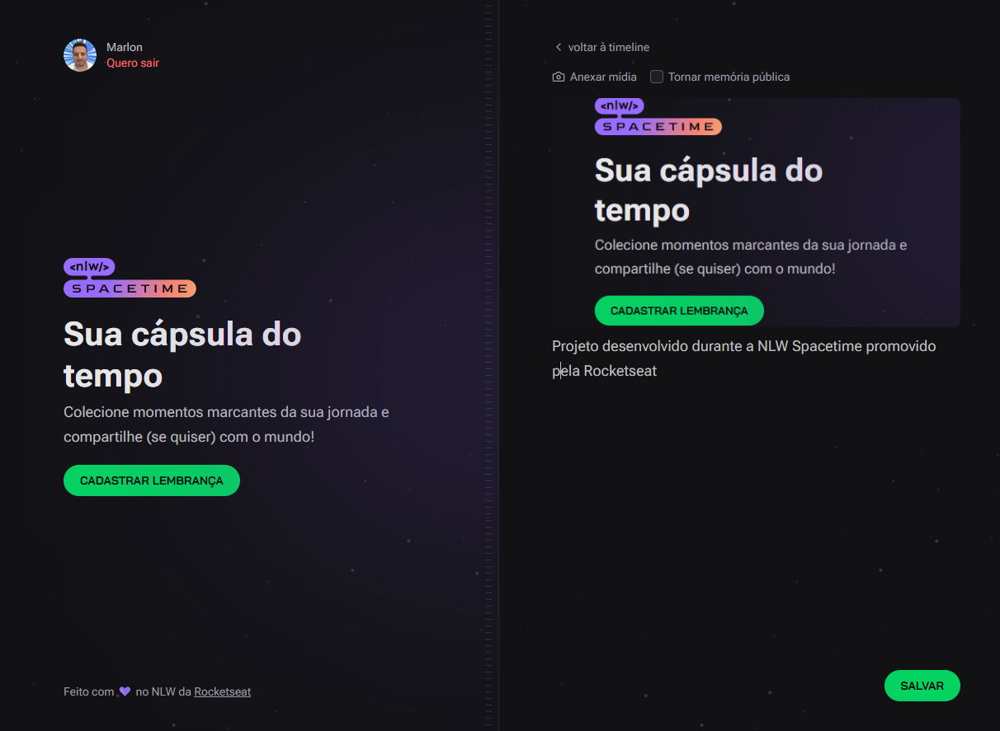

<h1 align="center">Next Level Up - Spacetime</h1>

<p align="center">
Evento exclusivo e gratuito, promovido pela Rocketseat.
Foram 5 dias de aula, totalizando um pouco mais de 10 horas de vídeo, desenvolvendo uma API em NodeJS, um Front-end em React e uma aplicação mobile em React Native.
</p>

<p align="center">
  <a href="#-tecnologias">Tecnologias</a>&nbsp;&nbsp;&nbsp;|&nbsp;&nbsp;&nbsp;
  <a href="#-iniciando-a-aplicação">Iniciando</a>&nbsp;&nbsp;&nbsp;|&nbsp;&nbsp;&nbsp;
  <a href="#-projeto">Projeto</a>&nbsp;&nbsp;&nbsp;|&nbsp;&nbsp;&nbsp;
  <a href="#memo-licença">Licença</a>&nbsp;&nbsp;&nbsp;|&nbsp;&nbsp;&nbsp;
  <a href="#-contato">Contato</a>
</p>

<p align="center">
  
</p>

<br>

<p align="center">
  
</p>
<p align="center">
  
</p>

## 🚀 Tecnologias

Esse projeto foi desenvolvido com as seguintes tecnologias:

- **Typescript**
- Back-end
  - **Node** + **Zod** + **Axios** + **Fastify**
  - **Prisma ORM** para acessar o banco de dados
- Front-end
  - **React**
  - **Next**
  - **Tailwind CSS** para estilização.
  - **dayjs** para formatar datas.
  - **Axios** para acessar a API.
- Mobile
  - **React Native**
  - **Expo**
  - **Nativewind**

## :car: Iniciando a aplicação

Baixe o repositório com git clone e entre nas pastas(web, mobile e server) para instalar as dependencias do projeto. Deixe o servidor executando e inicia as instanciâs desktop ou mobile.<br/>

```bash
$ git clone https://github.com/MarlonChi/nlw-spacetime
```

- Back-end

```bash
$ cd server
$ npm install
$ npm run dev
```

- Front-end

```bash
$ cd ..
$ cd web
$ npm install
$ npm run dev
```

- Mobile (Para isso, precisa ter um emulador aberto no computador ou conectar um celular android ligado por usb, baixar o app do expo na store e executar os comandos abaixo)

```bash
$ cd ..
$ cd mobile
$ npm install
$ npx expo start
```

## 💻 Projeto

O Spacetime é uma capsula do tempo onde permite o usuário cadastrar lembranças com imagens ou vídeos.
<br/>

## :memo: Licença

Esse projeto está sob a [licença MIT](LICENSE).

## :email: Contato

## E-mail: [**marlonchiodelli@hotmail.com**](mailto:marlonchiodelli@hotmail.com)
